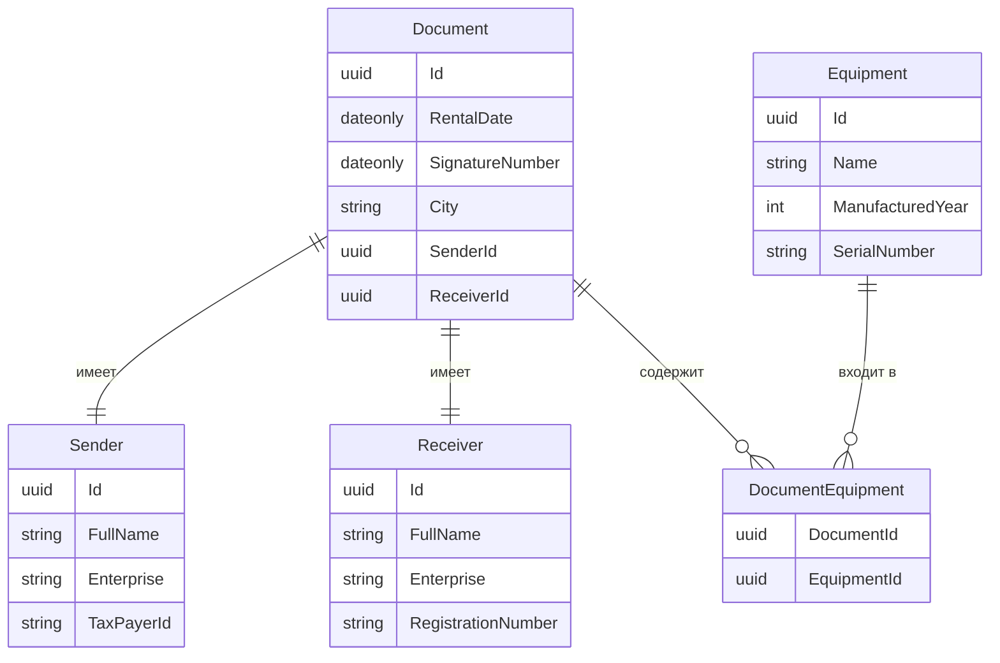

# Автоматизация акта о приеме-передачи оборудования

## Схема базы данных



## Реализация API
### CRUD документов
|verb| url                       | description            | request |response| codes|
|-|---------------------------|------------------------|--------|-|---------------------|
|GET| api/documents/            | Получает список всех документов |        |`IReadOnlyCollection<DocumentResponseApiModel>`| 200 OK|
|GET| api/documents/{id}        | Получает документ по идентификатору id | fromRoute: id |`DocumentResponseApiModel`| 200 OK<br/>404 Not Found|
|GET| api/documents/{id}/export | Экспортирует документ в Excel | fromRoute: id |Файл Excel| 200 OK<br/>404 Not Found|
|POST| api/documents/            | Добавляет новый документ | fromBody: `DocumentCreateApiModel` |`DocumentResponseApiModel`| 200 OK<br/>422 Unprocessable Entity<br/>404 Not Found |
|PUT| api/documents/{id}        | Редактирует документ с идентификатором id | fromRoute: id <br/>fromBody: `DocumentCreateApiModel` |`DocumentResponseApiModel`| 200 OK<br/>404 Not Found<br/>422 Unprocessable Entity |
|DELETE| api/documents/{id}        | Удаляет документ с идентификатором id | fromRoute: id | | 200 OK<br/>404 Not Found |
```javascript
// DocumentResponseApiModel
{
    Id: "1fba52c2-17c5-4731-aca0-e52247f2629",
    RentalDate: "16.08.2025",
    SignatureNumber: "16.08.2025",
    City: "Санкт-Петербург",
    Sender: 
        {
            SenderId: "57ebb48e-3093-4ac3-96ef-43d6dc36c744", 
            FullName: "Иванов Иван Иванович",
            Enterprise: "ООО ПЕТРОВИЧ",
            TaxPayerNum: "520205004556",
        },
    Receiver:
        {
            ReceiverId: "79c2b608-3455-4e87-be7d-18807a930505",
            FullName: "Иванов Иннокентий Иванович",
            Enterprise: "ООО Михалыч",
            RegistrationNumber: "1147847423899",   
        }
    Equipment: [
        {
            EquipmentId: "a624c88b-178c-4b9f-a67a-4541d5797f15",
            Name: "Ноутбук",
            ManufacturedYear: 2025,
            SerialNumber: "HS235AAA2",
        }
    ]
}
```
```javascript
// DocumentCreateApiModel
{
    RentalDate: "16.08.2025",
    SignatureNumber: "16.08.2025",
    City: "Санкт-Петербург",
    SenderId: "57ebb48e-3093-4ac3-96ef-43d6dc36c744",
    ReceiverId: "79c2b608-3455-4e87-be7d-18807a930505",
    EquipmentIds: [ "a624c88b-178c-4b9f-a67a-4541d5797f15", "b624c22b-178c-4b9f-c67b-661d5797f15" ]
}
```


### CRUD оборудования
|verb|url|description|request|response|codes|
|-|-|-|-|-|-|
|GET|api/equipment/|Получает список всего оборудования| |`[IReadOnlyCollection<EquipmentResponseApiModel>]`| 200 OK |
|GET| api/equipment/{id}| Получает оборудование по идентификатору id | fromRoute: id |`EquipmentResponseApiModel`| 200 OK<br/>404 Not Found|
|POST|api/equipment/|Добавляет новое оборудование| fromBody: `EquipmentCreateApiModel`|`EquipmentResponseApiModel`| 200 OK<br/>422 Unprocessable Entity<br/>404 Not Found |
|PUT|api/equipment/{id}|Редактирует оборудование с идентификатором id| fromRoute: id <br/>fromBody: `EquipmentCreateApiModel`|`EquipmentResponseApiModel`| 200 OK<br/>404 Not Found<br/>422 Unprocessable Entity |
|DELETE|api/equipment/{id}|Удаляет оборудование с идентификатором id| fromRoute: id | | 200 OK<br/>404 Not Found |
```javascript
// EquipmentResponseApiModel
{
    Id: "1fba52c2-17c5-4731-aca0-e52247f2629",
    Name: "Ноутбук",
    ManufacturedYear: 2025,
    SerialNumber: "HS235AAA2",
}
```
```javascript
// EquipmentCreateApiModel
{
    Name: "Ноутбук",
    ManufacturedYear: 2025,
    SerialNumber: "HS235AAA2",
}
```
### CRUD отправителя
|verb|url|description|request|response|codes|
|-|-|-|-|-|-|
|GET|api/senders/|Получает список всех отправителей| |`IReadOnlyCollection<SenderResponseApiModel>`| 200 OK |
|GET|api/senders/{id}| Получает отправителя по идентификатору id | fromRoute: id |`SenderResponseApiModel`| 200 OK<br/>404 Not Found|
|POST|api/senders/|Добавляет нового отправителя| fromBody: `SenderCreateApiModel`|`SenderResponseApiModel`| 200 OK<br/>422 Unprocessable Entity<br/>404 Not Found |
|PUT|api/senders/{id}|Редактирует отправителя с идентификатором id| fromRoute: id <br/>fromBody: `SenderCreateApiModel`|`SenderResponseApiModel`| 200 OK<br/>404 Not Found<br/>422 Unprocessable Entity |
|DELETE|api/senders/{id}|Удаляет отправителя с идентификатором id| fromRoute: id | | 200 OK<br/>404 Not Found |
```javascript
// SenderResponseApiModel
{
    Id: "1fba52c2-17c5-4731-aca0-e52247f2629",
    FullName: "Иванов Иван Иванович",
    Enterprise: "ООО ПЕТРОВИЧ"
    TaxPayerNum: "520205004556"
}
```
```javascript
// SenderCreateApiModel
{
    FullName: "Иванов Иван Иванович",
    Enterprise: "ООО ПЕТРОВИЧ"
    TaxPayerNum: "520205004556"
}
```
### CRUD принимающего
|verb|url|description|request|response|codes|
|-|-|-|-|-|-|
|GET|api/receivers/|Получает список всех принимающих| |`IReadOnlyCollection<ReceiverResponseApiModel>`| 200 OK |
|GET|api/receivers/{id}| Получает принимающего по идентификатору id | fromRoute: id |`ReceiverResponseApiModel`| 200 OK<br/>404 Not Found|
|POST|api/receivers/|Добавляет нового принимающего| fromBody: `ReceiverCreateApiModel`|`ReceiverResponseApiModel`| 200 OK<br/>422 Unprocessable Entity<br/>404 Not Found |
|PUT|api/receivers/{id}|Редактирует принимающего с идентификатором id| fromRoute: id <br/>fromBody: `ReceiverCreateApiModel`|`ReceiverResponseApiModel`| 200 OK<br/>404 Not Found<br/>422 Unprocessable Entity |
|DELETE|api/receivers/{id}|Удаляет принимающего с идентификатором id| fromRoute: id | | 200 OK<br/>404 Not Found |
```javascript
// ReceiverResponseApiModel
{
    Id: "1fba52c2-17c5-4731-aca0-e52247f2629",
    FullName: "Иванов Иван Иванович",
    Enterprise: "ООО ПЕТРОВИЧ"
    RegistrationNumber: "1147847423899"
}
```
```javascript
// ReceiverCreateApiModel
{
    FullName: "Иванов Иван Иванович",
    Enterprise: "ООО ПЕТРОВИЧ"
    RegistrationNumber: "1147847423899"
}
```
