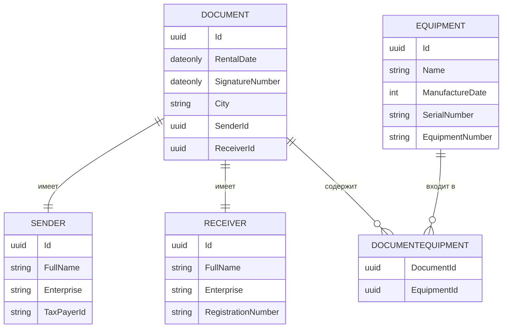

# Автоматизация акта о приеме-передачи оборудования

## Схема базы данных



## Реализация API
### CRUD документов
|verb|url|description|request|response|codes|
|-|-|-|-|-|-|
|GET|api/documents/|Получает список всех документов| |`IReadOnlyCollection<DocumentResponseApiModel>`| 200 OK |
|GET|api/documents/{id}/export|Экспортирует документ в Excel| fromRoute: id |Файл Excel| 200 OK<br/>404 Not Found |
|POST|api/documents/|Добавляет новый документ| fromBody: `DocumentRequestApiModel`|`DocumentResponseApiModel`| 200 OK<br/>422 Unprocessable Entity |
|PUT|api/documents/{id}|Редактирует документ с идентификатором id| fromRoute: id <br/>fromBody: `DocumentRequestApiModel`|`DocumentResponseApiModel`| 200 OK<br/>404 Not Found |
|DELETE|api/documents/{id}|Удаляет документ с идентификатором id| fromRoute: id | | 200 OK<br/>404 Not Found |
```javascript
// DocumentResponseApiModel
{
    Id: 1fba52c2-17c5-4731-aca0-e52247f2629,
    RentalDate: "16.08.2025",
    SignatureNumber: "АКТ-2025-567",
    City: "Санкт-Петербург",
    SenderId: 57ebb48e-3093-4ac3-96ef-43d6dc36c744,
    SenderFullName: "Иванов Иван Иванович",
    SenderEnterprise: "ООО ПЕТРОВИЧ",
    SenderTaxPayerId: 520205004556,
    ReceiverId: 79c2b608-3455-4e87-be7d-18807a930505,
    ReceiverFullName: "Иванов Иннокентий Иванович",
    ReceiverEnterprise: "ООО Михалыч",
    ReceiverRegistrationNumber: 1147847423899,
    Equipment: [
        {
            EquipmentId: a624c88b-178c-4b9f-a67a-4541d5797f15,
            Name: "Ноутбук",
            ManufactureDate: 2025,
            SerialNumber: "HS235AAA2",
            EquipmentNumber: "PROD-2025"
        }
    ]
}
```
```javascript
// DocumentRequestApiModel
{
    RentalDate: "16.08.2025",
    SignatureNumber: "АКТ-2025-567",
    City: "Санкт-Петербург",
    SenderId: 57ebb48e-3093-4ac3-96ef-43d6dc36c744,
    ReceiverId: 79c2b608-3455-4e87-be7d-18807a930505
    Equipment: [
        {
            EquipmentId: a624c88b-178c-4b9f-a67a-4541d5797f15,
            Name: "Ноутбук",
            ManufactureDate: 2025,
            SerialNumber: "HS235AAA2",
            EquipmentNumber: "PROD-2025"
        }
    ]
}
```


### CRUD оборудования
|verb|url|description|request|response|codes|
|-|-|-|-|-|-|
|GET|api/equipment/|Получает список всего оборудования| |`[IReadOnlyCollection<EquipmentResponseApiModel>]`| 200 OK |
|POST|api/equipment/|Добавляет новое оборудование| fromBody: `EquipmentRequestApiModel`|`EquipmentResponseApiModel`| 200 OK<br/>422 Unprocessable Entity |
|PUT|api/equipment/{id}|Редактирует оборудование с идентификатором id| fromRoute: id <br/>fromBody: `EquipmentRequestApiModel`|`EquipmentResponseApiModel`| 200 OK<br/>404 Not Found |
|DELETE|api/equipment/{id}|Удаляет оборудование с идентификатором id| fromRoute: id | | 200 OK<br/>404 Not Found |
```javascript
// EquipmentResponseApiModel
{
    Id: 1fba52c2-17c5-4731-aca0-e52247f2629,
    Name: "Ноутбук",
    ManufactureDate: 2025,
    SerialNumber: "HS235AAA2",
    EquipmentNumber: "PROD-2025"
}
```
```javascript
// EquipmentRequestApiModel
{
    Name: "Ноутбук",
    ManufactureDate: 2025,
    SerialNumber: "HS235AAA2",
    EquipmentNumber: "PROD-2025"
}
```
### CRUD отправителя
|verb|url|description|request|response|codes|
|-|-|-|-|-|-|
|GET|api/senders/|Получает список всех отправителей| |`IReadOnlyCollection<SenderResponseApiModel>`| 200 OK |
|POST|api/senders/|Добавляет нового отправителя| fromBody: `SenderRequestApiModel`|`SenderResponseApiModel`| 200 OK<br/>422 Unprocessable Entity |
|PUT|api/senders/{id}|Редактирует отправителя с идентификатором id| fromRoute: id <br/>fromBody: `SenderRequestApiModel`|`SenderResponseApiModel`| 200 OK<br/>404 Not Found |
|DELETE|api/senders/{id}|Удаляет отправителя с идентификатором id| fromRoute: id | | 200 OK<br/>404 Not Found |
```javascript
// SenderResponseApiModel
{
    Id: 1fba52c2-17c5-4731-aca0-e52247f2629,
    FullName: "Иванов Иван Иванович",
    Enterprise: "ООО ПЕТРОВИЧ"
    TaxPayerId: 520205004556
}
```
```javascript
// SenderRequestApiModel
{
    FullName: "Иванов Иван Иванович",
    Enterprise: "ООО ПЕТРОВИЧ"
    TaxPayerId: 520205004556
}
```
### CRUD принимающего
|verb|url|description|request|response|codes|
|-|-|-|-|-|-|
|GET|api/receivers/|Получает список всех принимающих| |`IReadOnlyCollection<ReceiverResponseApiModel>`| 200 OK |
|POST|api/receivers/|Добавляет нового принимающего| fromBody: `ReceiverRequestApiModel`|`ReceiverResponseApiModel`| 200 OK<br/>422 Unprocessable Entity |
|PUT|api/receivers/{id}|Редактирует принимающего с идентификатором id| fromRoute: id <br/>fromBody: `ReceiverRequestApiModel`|`ReceiverResponseApiModel`| 200 OK<br/>404 Not Found |
|DELETE|api/receivers/{id}|Удаляет принимающего с идентификатором id| fromRoute: id | | 200 OK<br/>404 Not Found |
```javascript
// ReceiverResponseApiModel
{
    Id: 1fba52c2-17c5-4731-aca0-e52247f2629,
    FullName: "Иванов Иван Иванович",
    Enterprise: "ООО ПЕТРОВИЧ"
    RegistrationNumber: 1147847423899
}
```
```javascript
// ReceiverRequestApiModel
{
    FullName: "Иванов Иван Иванович",
    Enterprise: "ООО ПЕТРОВИЧ"
    RegistrationNumber: 1147847423899
}
```
### Автор: Колобов Виктор
